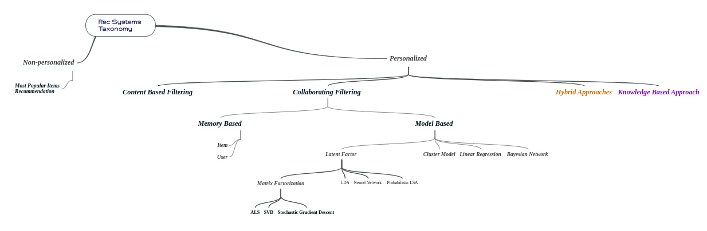

# Book-Recommendation-System | Collaborative Filtering Based

The purpose of a recommendation system basically is to search for content that would be interesting to an individual. Moreover, it involves a number of factors to create personalised lists of useful and interesting content specific to each user/individual. Recommendation systems are Artificial Intelligence based algorithms that skim through all possible options and create a customized list of items that are interesting and relevant to an individual. These results are based on their profile, search/browsing history, what other people with similar traits/demographics are watching, and how likely are you to watch those movies. This is achieved through predictive modeling and heuristics with the data available.

## Collaborative Based :
		
- Collaborative filtering systems are based on user-item interactions.
	
- Clusters of users with the same ratings and similar users.
	
- Book recommendation, so use cluster mechanism.
	
- We take only one parameter, ratings or comments.
	
- In short, collaborative filtering systems are based on the assumption that if a user likes item A and another user likes the same item A as well as another item, item B, the first user could also be interested in the second item.

- Issues are :

	- User-Item nXn matrix, so computationally expensive.

	- Only famous items will be recommended.

	- New items might not get recommended at all.

# Dataset has been used:

* [Dataset link](https://www.kaggle.com/datasets/arashnic/book-recommendation-dataset)
